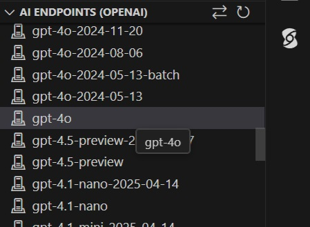

# Process Framework: Product Documentation .NET and declarative example

This project example demonstrates how to define, preview, and execute a process of generating product documentation using .NET classes and declarative AI Agents as process steps.

Note: it is recommended to work with this example using [Semantic Kernel Tools](https://marketplace.visualstudio.com/items?itemName=ms-semantic-kernel.semantic-kernel) VS Code extension.

## Prerequisites

- Install [.NET 8](https://dotnet.microsoft.com/download/dotnet/8.0).

## Setup

1. Open a terminal in the project directory.
2. Run `dotnet build` command to build the logic of the process nodes.
3. Run `dotnet user-secrets set "AZUREOPENAI_DEPLOYMENT_NAME" "YOUR_DEPLOYMENT_NAME"` to configure Azure OpenAI deployment name.
4. Run `dotnet user-secrets set "AZUREOPENAI_ENDPOINT" "YOUR_ENDPOINT"` to configure Azure OpenAI endpoint.
5. Run `az login` to authenticate using Azure CLI and get an access to Azure OpenAI deployment.

## Getting Started

1. Open the [product-documentation.process.yaml](./product-documentation.process.yaml) file in VS Code to start working with processes.
2. Open the [Program.cs](./Program.cs) file in VS Code to learn about imperative and declarative process approaches.

## Features

### Select an AI Model

To select an AI model:
- Open the Semantic Kernel extension in the side panel of Visual Studio Code.
- In the "AI Endpoints" section, choose your preferred AI provider and model.

### Preview a Process

To preview a process:
- Open the [product-documentation.process.yaml](./product-documentation.process.yaml) file.
- Click the **Preview Process** button in the top bar of the process file.

### Debug a Process

To debug a process:
- Open the [product-documentation.process.yaml](./product-documentation.process.yaml) file.
- Click the **Debug Process** button in the top bar of the process file.

### Process Node Logic

- The source code for each process node's logic is located in the [Steps](./Steps/) folder.
- Explore this folder to review or modify the logic for individual process steps.

## Reporting Issues

If you encounter any issues or have suggestions, please report them on our [GitHub repository](https://github.com/microsoft/semantic-kernel).

## MetaMetaMetaAgent: Self-Evolving Autonomous Architect

The **MetaMetaMetaAgent** is a self-evolving, autonomous software architect and engineer. It operates inside the platform, continuously improving itself and the system using a recursive PMCR (Plan → Make → Check → Reflect) loop. It can:
- Generate and refactor workflows, agents, and skills
- Modify its own prompt and architecture
- Chunk and summarize large prompts/files to handle token limits
- Document all reasoning and changes for auditability
- Propose and implement improvements to itself and the platform

See `agents/MetaMetaMetaAgent.md` for the full prompt and rules.
