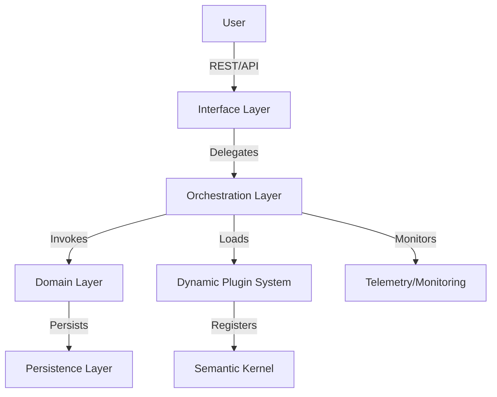
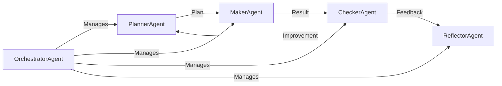
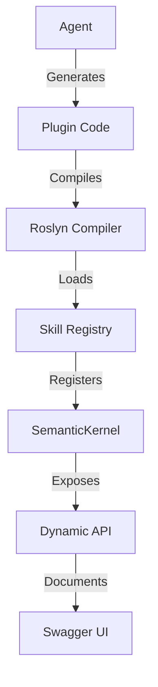

# Architecture Diagrams

This section provides visual representations of the system's architecture, workflows, and agent interactions. Use these diagrams to understand system structure, data flow, and extensibility points.

## 1. High-Level System Architecture

## 2. Agent Orchestration (PMCR Loop)

## 3. Dynamic Plugin/API Loading

## 4. Data Flow and State

- All agent context, plans, and results are persisted in the database for audit, recovery, and learning.
- Dynamic plugins and templates are versioned and stored for traceability.
- Monitoring and telemetry data flows to dashboards for real-time observability.

## 5. Extensibility Points

- New skills/plugins can be added at runtime via the plugin system.
- New API endpoints can be generated and exposed dynamically.
- Prompty templates can be updated for agent behavior evolution.

---

**See also:** [Layers](layers.md), [Agents](agents.md), [Extensibility](extensibility.md)
