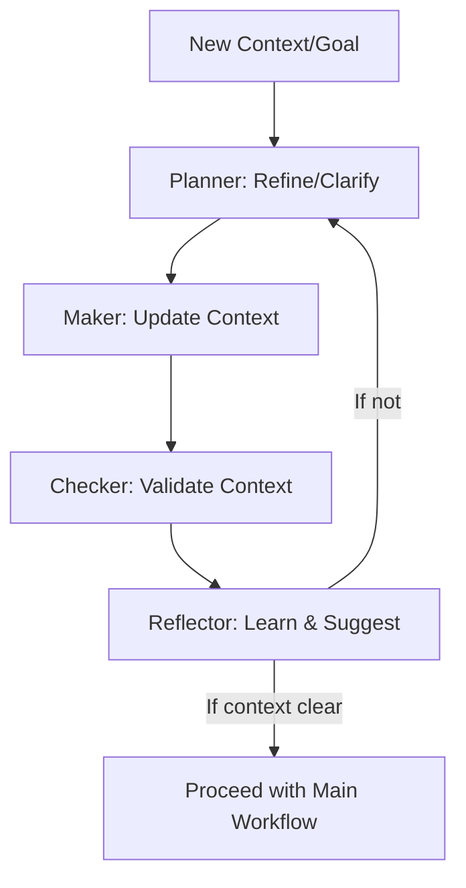

# Production-Ready Enterprise Checklist: Meta-Programmable Self-Evolving System

---

## System Initialization & Version Control

> **Context/Goal Refinement Reminder:**
> Before initializing the system, clarify and optimize the initialization/versioning context/goal (e.g., repository structure, versioning policy, audit requirements) using the [Context/Goal Refinement Loop](#contextgoal-refinement-loop-meta-pmcr).

- [ ] **Initialize System Repository**
  - Run `git init` in the project root to create a new repository.
    - *Reasoning: Establishes a foundation for all version control, traceability, and collaboration.*
    - **Cognitive Trail:** .git directory, initial commit log, and repository metadata.
  - Add a `.gitignore` file to exclude build artifacts, secrets, and irrelevant files.
    - *Reasoning: Prevents accidental versioning of sensitive or unnecessary files, keeping the repo clean and secure.*
    - **Cognitive Trail:** .gitignore file, commit history, and excluded files list.
  - Establish a clear repository structure (e.g., src/, docs/, scripts/, config/).
    - *Reasoning: Promotes organization, discoverability, and modularity from the outset.*
    - **Cognitive Trail:** Directory tree, README.md, and structure documentation.

- [ ] **Set Up Version Control Best Practices**
  - Define a branching strategy (e.g., main, develop, feature/*, hotfix/*).
    - *Reasoning: Supports parallel development, safe releases, and rapid hotfixes.*
    - **Cognitive Trail:** Branch naming conventions, branch list, and workflow documentation.
  - Enforce descriptive, context-rich commit messages (see [Git Workflow & Version Control (CLI-Driven)](#git-workflow--version-control-cli-driven)).
    - *Reasoning: Ensures every change is traceable, auditable, and understandable.*
    - **Cognitive Trail:** Commit logs, message templates, and PR descriptions.
  - Use tags for releases and major milestones.
    - *Reasoning: Enables easy rollback, release tracking, and historical analysis.*
    - **Cognitive Trail:** Tag list, release notes, and changelog entries.
  - Maintain a [Changelog](../changelog/release-notes.md) from the very first commit.
    - *Reasoning: Provides a transparent, auditable record of all changes and system evolution.*
    - **Cognitive Trail:** Changelog file, release notes, and version history logs.

- [ ] **Version All Configuration, Templates, and Code**
  - Ensure all YAML, Markdown, config files, and templates are tracked in version control.
    - *Reasoning: Guarantees that every operational artifact is auditable, revertible, and can be evolved safely.*
    - **Cognitive Trail:** Versioned config/templates, commit history, and rollback records.
  - Reference or automate repo setup using scripts (see [scripts/](../../scripts/)).
    - *Reasoning: Standardizes and accelerates initialization for new environments or contributors.*
    - **Cognitive Trail:** Setup scripts, automation logs, and onboarding documentation.

---

## Context/Goal Refinement Loop (Meta-PMCR)

Before any workflow, checklist item, or sub-task is executed, the system first refines and optimizes the context or goal through its own Planner → Maker → Checker → Reflector (PMCR) loop. This ensures that every action is always based on the most current, clarified, and aligned intent—enabling continuous improvement, auditability, and meta-cognition.

**Stepwise Description:**
1. **Planner:** Decomposes and clarifies the context/goal, identifies ambiguities, and proposes optimizations or measurable outcomes.
2. **Maker:** Updates the context with new details, resolves ambiguities, and incorporates new constraints or refinements.
3. **Checker:** Validates that the context/goal is now clear, actionable, and aligned with system capabilities and constraints.
4. **Reflector:** Analyzes how well the context/goal served the process, logs lessons, and suggests further refinements for future cycles.
5. **Orchestrator:** Decides whether to proceed with the main workflow or trigger another refinement cycle if the context is still unclear.

**Continuous Alignment:**
- At every major step, the current context/goal is re-evaluated. If new information, constraints, or feedback arise, the context is piped through another PMCR loop.
- This keeps the "thought" or "idea" always aligned with reality, system capabilities, and stakeholder intent.

**Auditability:**
- All context/goal changes, clarifications, and refinements are logged as part of the cognitive trail, ensuring full traceability and explainability.

---

## I. Foundation & Environment

> **Context/Goal Refinement Reminder:**
> Before starting this phase, clarify and optimize the foundational context/goal (e.g., system architecture, technology stack, environment requirements) using the [Context/Goal Refinement Loop](#contextgoal-refinement-loop-meta-pmcr).

- [ ] **Adopt Clean Architecture Principles**
  - Separate Interface, Application, Domain, and Infrastructure layers as per [Clean Architecture](../design/clean-architecture.md).
    - *Reasoning: Ensures modularity, testability, and clear separation of concerns, making the system easier to evolve and audit.*
    - **Cognitive Trail:** Architecture diagrams, codebase structure, interface definitions, and documentation in the repository.
  - Enforce dependency inversion and use DI for all services, agents, and plugins.
    - *Reasoning: Promotes loose coupling and allows for runtime extensibility and easier testing.*
    - **Cognitive Trail:** DI container configuration files, service registration code, and testable service/unit test artifacts.
  - Document all interfaces and contracts for skills, plugins, and agent integration.
    - *Reasoning: Guarantees that all integrations are explicit, discoverable, and maintainable for both humans and AI agents.*
    - **Cognitive Trail:** Markdown docs, interface files, API reference docs, and version-controlled documentation.

- [ ] **Provision Core Technologies**
  - .NET 9, C# 13, Aspire 9.3 for DI/configuration.
    - *Reasoning: Provides a modern, enterprise-grade, and future-proof foundation for the platform.*
    - **Cognitive Trail:** Project files, package references, Aspire configuration, and build logs.
  - Semantic Kernel (SK) for agent orchestration and context management.
    - *Reasoning: Enables multi-agent reasoning, context sharing, and declarative prompt execution.*
    - **Cognitive Trail:** SK configuration files, agent registration code, and orchestration logs.
  - Roslyn for dynamic C# code/plugin compilation.
    - *Reasoning: Allows runtime skill/plugin generation and meta-programmability.*
    - **Cognitive Trail:** Roslyn service logs, generated DLLs, plugin registry entries, and audit logs of code generation events.
  - NSwag for OpenAPI-driven dynamic API generation.
    - *Reasoning: Supports runtime API creation and documentation, enabling rapid integration and exposure of new capabilities.*
    - **Cognitive Trail:** OpenAPI spec files, generated controller code, Swagger UI updates, and API registry entries.
  - PostgreSQL/EF Core for persistence; Redis for distributed cache.
    - *Reasoning: Ensures reliable, scalable, and auditable state and knowledge management.*
    - **Cognitive Trail:** Database schema migrations, connection strings, and operational logs.
  - OpenTelemetry/Serilog for observability and logging.
    - *Reasoning: Provides end-to-end traceability, monitoring, and compliance.*
    - **Cognitive Trail:** Telemetry dashboards, log files, and trace IDs linked to actions.
  - Entra ID (Azure AD) for authentication/authorization.
    - *Reasoning: Enforces enterprise security and access control for all endpoints and agents.*
    - **Cognitive Trail:** Auth configuration, access logs, and audit records of authentication events.

- [ ] **Persistent Database as Source of Truth**
  - Store all agent prompts, skills, knowledge, and configuration in a persistent database (e.g., Postgres).
    - *Reasoning: Ensures state persistence, multi-instance scalability, auditability, and rollback.*
    - **Cognitive Trail:** Database schema, migration logs, versioned prompt/skill/config tables, and audit records.
  - Maintain version history and audit trails for all changes (prompts, skills, config, knowledge).
    - *Reasoning: Enables compliance, rollback, and external oversight.*
    - **Cognitive Trail:** ChangeLog table, audit logs, and rollback event records.

---

## II. Agent & Template Setup

> **Context/Goal Refinement Reminder:**
> Before setting up agents or templates, clarify and optimize the agent/template context/goal (e.g., agent roles, template requirements, integration points) using the [Context/Goal Refinement Loop](#contextgoal-refinement-loop-meta-pmcr).

- [ ] **Define and Register Agents**
  - OrchestratorAgent: Goal intake, delegation, context management.
    - *Reasoning: Centralizes workflow control and ensures all goals are processed and delegated appropriately.*
    - **Cognitive Trail:** Agent registration code, orchestration logs, and agent configuration files.
  - PlannerAgent: Decompose goals, output actionable plans.
    - *Reasoning: Breaks down complex objectives into manageable, auditable tasks for execution.*
    - **Cognitive Trail:** Plan output logs, plan artifacts, and plan review comments.
  - MakerAgent: Execute plans, invoke/generate skills, handle dynamic plugins.
    - *Reasoning: Implements the plan, leveraging and extending system capabilities as needed.*
    - **Cognitive Trail:** Execution logs, skill invocation records, and plugin registry updates.
  - CheckerAgent: Validate outputs, enforce quality/security.
    - *Reasoning: Ensures all outputs meet defined criteria, policies, and compliance standards.*
    - **Cognitive Trail:** Validation reports, test results, and compliance check logs.
  - ReflectorAgent: Analyze outcomes, propose improvements, update templates.
    - *Reasoning: Drives continuous improvement and learning by analyzing results and updating system logic.*
    - **Cognitive Trail:** Reflection logs, improvement proposals, and template update PRs.
  - Meta/LearningAgent: Retrain models, optimize system parameters, update knowledge base.
    - *Reasoning: Enables advanced self-optimization, ML integration, and adaptation based on historical data and performance.*
    - **Cognitive Trail:** Model training logs, parameter tuning records, updated model artifacts, and knowledge base updates.
  - See [Agents](../architecture/agents.md) and [Prompt Templates](../design/prompt-templates.md).

- [ ] **Implement and Version Prompty Templates**
  - Store YAML/Markdown templates in a versioned registry (DB or Git).
    - *Reasoning: Ensures all agent logic is declarative, traceable, and can be rolled back or evolved safely.*
    - **Cognitive Trail:** Git commit history, template registry entries, and version tags.
  - Use Liquid/Handlebars syntax for dynamic context injection.
    - *Reasoning: Allows agents to reason with up-to-date, context-aware information at runtime.*
    - **Cognitive Trail:** Template files with dynamic sections, context injection logs, and rendered prompt examples.
  - Document variables, sections, and agent policies in each template.
    - *Reasoning: Makes templates understandable and maintainable for both humans and AI.*
    - **Cognitive Trail:** Template documentation, inline comments, and doc site updates.
  - Establish approval workflow for template changes.
    - *Reasoning: Prevents accidental or unauthorized changes to critical agent logic.*
    - **Cognitive Trail:** PR review records, approval logs, and change request tickets.

---

## III. Plugin, Skill, and API Extensibility

> **Context/Goal Refinement Reminder:**
> Before enabling extensibility, clarify and optimize the plugin/skill/API context/goal (e.g., extensibility requirements, security constraints, integration needs) using the [Context/Goal Refinement Loop](#contextgoal-refinement-loop-meta-pmcr).

- [ ] **Enable Dynamic Plugin System**
  - Register all code-based (DLL) and template-driven plugins in a central registry.
    - *Reasoning: Centralizes discovery, management, and audit of all system capabilities.*
    - **Cognitive Trail:** Plugin registry entries, plugin metadata, and audit logs of plugin registration events.
  - Implement runtime plugin loading/unloading (Roslyn for code, Prompty for templates).
    - *Reasoning: Allows the system to evolve and extend itself without downtime or redeployment.*
    - **Cognitive Trail:** Plugin load/unload logs, dynamic assembly load events, and plugin lifecycle records.
  - Enforce security validation and sandboxing for all dynamic code.
    - *Reasoning: Protects the system from unsafe or unauthorized code execution.*
    - **Cognitive Trail:** Security validation reports, sandbox logs, and approval workflow records.
  - Support external tool integration (e.g., Playwright, RPA, ML.NET, NATS, Ollama, Azure Foundry) as plugins/skills.
    - *Reasoning: Extends system reach into legacy systems, browser automation, messaging, and custom ML.*
    - **Cognitive Trail:** Integration skill code, plugin registry updates, and audit logs.
  - See [Plugin System](../design/plugin-system.md) and [Extensibility](../architecture/extensibility.md).

- [ ] **Support Dynamic API Generation**
  - Accept OpenAPI specs as input (from agents or users).
    - *Reasoning: Enables rapid, declarative definition of new APIs for integration and automation.*
    - **Cognitive Trail:** OpenAPI spec files, API design PRs, and API registry entries.
  - Use NSwag to generate C# controllers from specs.
    - *Reasoning: Automates the translation from API spec to executable code, reducing manual effort and errors.*
    - **Cognitive Trail:** Generated controller code, build logs, and code review comments.
  - Compile controllers at runtime with Roslyn.
    - *Reasoning: Supports hot-patching and immediate availability of new endpoints.*
    - **Cognitive Trail:** Compilation logs, generated DLLs, and plugin registry updates.
  - Register new endpoints with ASP.NET Core routing and Swagger UI.
    - *Reasoning: Ensures discoverability and usability of all APIs for both humans and machines.*
    - **Cognitive Trail:** Swagger UI updates, API documentation, and endpoint registration logs.
  - Apply authentication, authorization, and audit logging to all dynamic APIs.
    - *Reasoning: Maintains enterprise security and compliance for all exposed capabilities.*
    - **Cognitive Trail:** Auth config files, access logs, and audit records for API calls.
  - See [Dynamic API](../design/dynamic-api.md).

---

## IV. Chain-of-Thought Execution Loop (PMCR + Orchestration)

> **Context/Goal Refinement Reminder:**
> Before executing the main workflow, clarify and optimize the execution context/goal (e.g., user intent, system objectives, constraints) using the [Context/Goal Refinement Loop](#contextgoal-refinement-loop-meta-pmcr).

- [ ] **Goal Intake & Context Initialization**
  - Receive and log new goal/intent (user, system, or feedback).
    - *Reasoning: Captures all objectives and triggers, ensuring nothing is missed and all actions are auditable.*
    - **Cognitive Trail:** Goal intake logs, event records, and context initialization artifacts.
  - Initialize shared context (user, constraints, priorities, history).
    - *Reasoning: Provides agents with the necessary information to make context-aware decisions.*
    - **Cognitive Trail:** Context objects, session logs, and context snapshots.
  - Load current system state, memory, and logs to inform the context (see [Knowledge Base](../reference/database-schema.md)).
    - *Reasoning: Leverages historical data and system memory for smarter, more informed planning and execution.*
    - **Cognitive Trail:** Memory retrieval logs, knowledge base queries, and loaded state artifacts.
  - Retrieve recent feedback, audit logs, and improvement suggestions.
    - *Reasoning: Ensures the system learns from past actions and incorporates feedback into new cycles.*
    - **Cognitive Trail:** Feedback event logs, audit trail entries, and improvement suggestion records.
  - Set clear goal or improvement objective for the cycle.
    - *Reasoning: Focuses the system on a specific, measurable outcome for each iteration.*
    - **Cognitive Trail:** Goal definition artifacts, planning documents, and cycle objective logs.

- [ ] **Planning**
  - Orchestrator delegates to PlannerAgent.
    - *Reasoning: Ensures the right agent is responsible for decomposing and sequencing tasks.*
    - **Cognitive Trail:** Delegation logs, agent assignment records, and orchestration event logs.
  - PlannerAgent decomposes the goal into actionable tasks (feature, fix, refactor, doc update).
    - *Reasoning: Breaks down complexity and enables parallel or sequential execution as needed.*
    - **Cognitive Trail:** Task breakdown documents, plan artifacts, and task assignment logs.
  - Identify dependencies, required skills, and success criteria.
    - *Reasoning: Reduces risk of failure by making all requirements explicit and measurable.*
    - **Cognitive Trail:** Dependency graphs, skill requirement lists, and success criteria checklists.
  - Plan for automated testing, validation, and deployment.
    - *Reasoning: Embeds quality and reliability into the process from the start.*
    - **Cognitive Trail:** Test plans, validation checklists, and deployment strategy docs.
  - Identify missing skills/APIs and flag for dynamic generation.
    - *Reasoning: Ensures the system can extend itself to meet new requirements without manual intervention.*
    - **Cognitive Trail:** Skill gap analysis, flagged requirements, and dynamic generation requests.

- [ ] **Execution**
  - Orchestrator passes plan to MakerAgent.
    - *Reasoning: Delegates implementation to the agent best suited for execution and code generation.*
    - **Cognitive Trail:** Plan handoff logs, execution assignment records, and agent invocation logs.
  - MakerAgent executes each step:
    - Invoke existing skills/plugins.
      - *Reasoning: Reuses proven capabilities for efficiency and reliability.*
      - **Cognitive Trail:** Skill invocation logs, plugin usage records, and execution traces.
    - If missing, generate new skill/plugin (Roslyn) or API (NSwag/OpenAPI).
      - *Reasoning: Enables meta-programmability and continuous expansion of system capabilities.*
      - **Cognitive Trail:** Code generation logs, new plugin registry entries, and audit records of code creation.
    - Implement or update code, templates, or configuration as per the plan.
      - *Reasoning: Ensures all changes are intentional, traceable, and aligned with the plan.*
      - **Cognitive Trail:** Code diffs, template update PRs, and configuration change logs.
    - Log all actions and results in context.
      - *Reasoning: Maintains a complete audit trail for compliance and learning.*
      - **Cognitive Trail:** Execution logs, result records, and context update artifacts.

- [ ] **Automated Build & Test Loop**
  - Run automated build and test scripts (e.g., `dotnet build`, `dotnet test`).
    - *Reasoning: Validates that all changes are functional and do not break existing capabilities.*
    - **Cognitive Trail:** Build logs, test reports, and CI pipeline results.
  - On build/test failure, log errors, update context, and trigger re-planning or correction.
    - *Reasoning: Ensures rapid feedback and correction, minimizing downtime or defects.*
    - **Cognitive Trail:** Error logs, failure reports, and re-planning tickets.
  - On success, proceed to commit and version control.
    - *Reasoning: Only validated changes are promoted, ensuring system stability.*
    - **Cognitive Trail:** Commit logs, version tags, and changelog entries.

- [ ] **Git Workflow & Version Control (CLI-Driven)**
  - Stage all changes using CLI tools (e.g., `git add .`).
    - *Reasoning: Automates and standardizes the process for both human and AI agents.*
    - **Cognitive Trail:** Staged file lists, CLI command logs, and git status outputs.
  - Commit changes with descriptive, context-rich messages (e.g., `git commit -m "[AI/Agent] 
"`).
    - *Reasoning: Provides traceability and context for every change, supporting audit and rollback.*
    - **Cognitive Trail:** Commit messages, git log entries, and PR descriptions.
  - Push to remote repository (`git push`).
    - *Reasoning: Ensures all changes are backed up and available for collaboration or review.*
    - **Cognitive Trail:** Remote branch updates, push logs, and repository activity records.
  - Create or update a Pull Request using CLI (e.g., `gh pr create` or `gh pr update`).
    - *Reasoning: Enables peer or automated review, and supports CI/CD triggers.*
    - **Cognitive Trail:** PR links, review comments, and merge status logs.
  - Reference related issues, feedback, or improvement logs in the PR description.
    - *Reasoning: Links changes to their rationale and context, supporting traceability and learning.*
    - **Cognitive Trail:** Issue links, feedback references, and cross-linked PRs.
  - Ensure every change is traceable and auditable in git history.
    - *Reasoning: Guarantees compliance and supports forensic analysis if needed.*
    - **Cognitive Trail:** Git history, audit trail entries, and code review records.

- [ ] **Automated Review & Continuous Integration**
  - Trigger CI/CD pipeline (e.g., via GitHub Actions) for build, test, and deploy pipelines.
    - *Reasoning: Automates quality gates and ensures only validated changes reach production.*
    - **Cognitive Trail:** CI/CD pipeline logs, build/test/deploy status, and badge updates.
  - Monitor pipeline results; on failure, log and trigger correction loop.
    - *Reasoning: Provides rapid feedback and supports continuous improvement.*
    - **Cognitive Trail:** Failure notifications, error logs, and correction tickets.
  - On success, merge PR (automatically or with required approvals).
    - *Reasoning: Ensures all merges are intentional and meet quality standards.*
    - **Cognitive Trail:** Merge logs, approval records, and release notes.
  - Tag releases and update [Changelog](../changelog/release-notes.md).
    - *Reasoning: Maintains a clear history of changes and supports rollback or audit.*
    - **Cognitive Trail:** Release tags, changelog entries, and release artifacts.

- [ ] **Deployment & Rollback Automation**
  - Deploy to staging/production using CLI tools (e.g., `kubectl`, `az`, `docker`, or platform-specific scripts).
    - *Reasoning: Standardizes and automates deployment, reducing human error and downtime.*
    - **Cognitive Trail:** Deployment logs, CLI command outputs, and deployment status dashboards.
  - Run health checks and smoke tests post-deployment.
    - *Reasoning: Validates system health and readiness before full rollout.*
    - **Cognitive Trail:** Health check logs, smoke test reports, and monitoring dashboard screenshots.
  - If issues are detected, trigger automated rollback using versioned artifacts and git history.
    - *Reasoning: Minimizes impact of failures and ensures rapid recovery.*
    - **Cognitive Trail:** Rollback logs, versioned artifact records, and incident reports.

- [ ] **Validation**
  - CheckerAgent reviews outputs after each step or at plan completion.
    - *Reasoning: Ensures all deliverables meet defined standards and requirements.*
    - **Cognitive Trail:** Validation checklists, review logs, and sign-off records.
  - Run code quality, security, and compliance checks.
    - *Reasoning: Protects the system from defects, vulnerabilities, and policy violations.*
    - **Cognitive Trail:** Static analysis reports, security scan results, and compliance audit logs.
  - Flag issues, suggest corrections, or escalate for re-planning.
    - *Reasoning: Supports continuous improvement and rapid correction of issues.*
    - **Cognitive Trail:** Issue tracker entries, correction tickets, and escalation logs.

- [ ] **Reflection & Learning**
  - ReflectorAgent analyzes the full process (goal, plan, actions, results, issues).
    - *Reasoning: Enables the system to learn from every cycle and avoid repeating mistakes.*
    - **Cognitive Trail:** Reflection logs, learning reports, and improvement proposals.
  - Log lessons learned, update knowledge base, and propose improvements.
    - *Reasoning: Builds institutional memory and supports future planning and optimization.*
    - **Cognitive Trail:** Knowledge base update logs, improvement suggestion records, and documentation updates.
  - If needed, update Prompty templates, system parameters, or generate new skills.
    - *Reasoning: Ensures the system adapts to new requirements and lessons learned.*
    - **Cognitive Trail:** Template update PRs, parameter change logs, and new skill registry entries.
  - Decide (Orchestrator) if another iteration is needed or if the goal is achieved.
    - *Reasoning: Supports iterative, goal-driven progress and prevents premature completion.*
    - **Cognitive Trail:** Iteration decision logs, completion status records, and summary reports.
  - Document all changes, rationale, and next steps in [REFLECTIONS.md] and [SYSTEM_PLAN.md] (see [Continuous Improvement](../continuous-improvement/feedback-loop.md)).
    - *Reasoning: Maintains a transparent, auditable record of all decisions and improvements.*
    - **Cognitive Trail:** REFLECTIONS.md and SYSTEM_PLAN.md git diffs, documentation PRs, and audit trail entries.

---

## V. Continuous Improvement & Governance

> **Context/Goal Refinement Reminder:**
> Before starting improvement or governance cycles, clarify and optimize the improvement/governance context/goal (e.g., feedback, compliance, optimization targets) using the [Context/Goal Refinement Loop](#contextgoal-refinement-loop-meta-pmcr).

- [ ] **Feedback Loop & Self-Evolution**
  - Collect explicit (user) and implicit (system/agent) feedback.
    - *Reasoning: Ensures the system is always learning and adapting to real-world needs.*
    - **Cognitive Trail:** Feedback forms, event logs, and feedback database entries.
  - Meta-agents analyze feedback, logs, and metrics for improvement opportunities.
    - *Reasoning: Automates the identification of optimization and learning opportunities.*
    - **Cognitive Trail:** Analysis reports, improvement tickets, and meta-agent logs.
  - Plan and implement improvements in the next cycle (template, skill, or workflow updates).
    - *Reasoning: Embeds continuous improvement into the system's DNA.*
    - **Cognitive Trail:** Improvement plan docs, implementation PRs, and cycle review logs.
  - Version and audit all changes; support rollback for regressions.
    - *Reasoning: Maintains system stability and compliance while evolving.*
    - **Cognitive Trail:** Version tags, audit logs, and rollback event records.
  - See [Feedback Loop](../continuous-improvement/feedback-loop.md), [Self-Evolution](../continuous-improvement/self-evolution.md), [Meta-Agents](../continuous-improvement/meta-agents.md).

- [ ] **Automated Parameter Tuning & ML Integration**
  - Use ML.NET or heuristics to tune agent parameters (e.g., LLM temperature, parallelism, skill selection).
    - *Reasoning: Optimizes system performance and adaptability based on real-world data and advanced analytics.*
    - **Cognitive Trail:** Parameter tuning logs, ML model artifacts, and performance metric dashboards.
  - Run controlled experiments and track impact on metrics.
    - *Reasoning: Ensures changes are data-driven and measurable.*
    - **Cognitive Trail:** Experiment logs, metric comparison reports, and experiment result summaries.

- [ ] **Plugin/Skill Optimization & Incremental Evolution**
  - Monitor usage and performance of all skills/plugins.
    - *Reasoning: Identifies underperforming or redundant capabilities for improvement or removal.*
    - **Cognitive Trail:** Usage analytics, performance dashboards, and plugin review reports.
  - Refactor, consolidate, or prune plugins as needed.
    - *Reasoning: Keeps the system lean, efficient, and maintainable.*
    - **Cognitive Trail:** Refactor PRs, plugin removal logs, and registry updates.
  - Support meta-level competition (multiple planners/strategies) and adopt best performers.
    - *Reasoning: Encourages innovation and continuous optimization through internal competition.*
    - **Cognitive Trail:** Competition logs, performance comparison reports, and adoption decision records.
  - Enable feature flags and staged rollout for new capabilities.
    - *Reasoning: Safely introduces new features and allows rollback if issues arise.*
    - **Cognitive Trail:** Feature flag config, rollout logs, and rollback event records.

- [ ] **Security, Audit, and Compliance**
  - Enforce least privilege for all skills and plugins.
    - *Reasoning: Minimizes risk and exposure in case of compromise.*
    - **Cognitive Trail:** Access control lists, privilege audit logs, and security policy docs.
  - Log all agent actions, code generations, and API changes with correlation IDs.
    - *Reasoning: Provides full traceability for compliance and incident response.*
    - **Cognitive Trail:** Action logs, correlation ID mappings, and incident response reports.
  - Run static/dynamic analysis on all generated code.
    - *Reasoning: Detects vulnerabilities and ensures code quality before deployment.*
    - **Cognitive Trail:** Static analysis reports, dynamic scan results, and code review comments.
  - Require human approval for high-impact or sensitive changes.
    - *Reasoning: Adds a layer of oversight for critical operations.*
    - **Cognitive Trail:** Approval logs, sign-off records, and change request tickets.
  - Maintain full audit trails and support explainability for all decisions.
    - *Reasoning: Ensures transparency and accountability at every step.*
    - **Cognitive Trail:** Audit trail files, explainability reports, and decision documentation.
  - See [Security](../reference/security.md).

---

## VI. Operations, Scaling, and Deployment

> **Context/Goal Refinement Reminder:**
> Before operationalizing, scaling, or deploying, clarify and optimize the operational context/goal (e.g., deployment targets, scaling requirements, monitoring needs) using the [Context/Goal Refinement Loop](#contextgoal-refinement-loop-meta-pmcr).

- [ ] **Cloud-Native & Scalable Deployment**
  - Deploy stateless API layer behind a load balancer.
    - *Reasoning: Enables horizontal scaling and high availability.*
    - **Cognitive Trail:** Load balancer config, deployment manifests, and scaling event logs.
  - Use distributed queues for agent orchestration (e.g., NATS).
    - *Reasoning: Supports distributed, resilient, and scalable agent workflows.*
    - **Cognitive Trail:** Queue configuration files, message logs, and orchestration event records.
  - Store plugins/skills in shared persistent storage.
    - *Reasoning: Ensures all nodes have access to the latest capabilities and can recover from failure.*
    - **Cognitive Trail:** Storage config, plugin registry snapshots, and recovery logs.
  - Use Kubernetes/Helm for deployment, HPA for autoscaling, and service mesh for secure comms.
    - *Reasoning: Automates deployment, scaling, and secure communication in cloud environments.*
    - **Cognitive Trail:** Helm charts, Kubernetes manifests, autoscaler logs, and service mesh config files.
  - Implement health checks, rolling upgrades, and blue/green deployments.
    - *Reasoning: Minimizes downtime and risk during updates.*
    - **Cognitive Trail:** Health check logs, upgrade event records, and deployment status dashboards.
  - See [Scaling](../operations/scaling.md), [Deployment](../operations/deployment.md).

- [ ] **Observability & Monitoring**
  - Integrate OpenTelemetry for distributed tracing and metrics.
    - *Reasoning: Provides real-time visibility into system health and performance.*
    - **Cognitive Trail:** Trace logs, metric dashboards, and alert history.
  - Set up dashboards and alerts for key metrics (success rate, latency, error rates).
    - *Reasoning: Enables proactive detection and resolution of issues.*
    - **Cognitive Trail:** Dashboard screenshots, alert config files, and alert notification logs.
  - Monitor feedback loop effectiveness and improvement trends.
    - *Reasoning: Validates that continuous improvement mechanisms are working as intended.*
    - **Cognitive Trail:** Feedback loop reports, improvement trend charts, and retrospective meeting notes.
  - See [Telemetry](../reference/telemetry.md), [Monitoring](../how-to/monitoring.md).

- [ ] **CI/CD & Change Management**
  - Use GitHub Actions (or equivalent) for build, test, and deploy pipelines.
    - *Reasoning: Automates and standardizes the release process for reliability and speed.*
    - **Cognitive Trail:** CI/CD pipeline logs, workflow YAML files, and build/test/deploy status badges.
  - Automate regression testing for all self-modifications.
    - *Reasoning: Prevents new changes from breaking existing functionality.*
    - **Cognitive Trail:** Regression test reports, test coverage metrics, and test run logs.
  - Enforce code review and approval for critical changes.
    - *Reasoning: Ensures all changes are vetted and meet quality standards.*
    - **Cognitive Trail:** Code review comments, approval logs, and merge records.

---

## VII. Example End-to-End Checklist (for a New Goal)

> **Context/Goal Refinement Reminder:**
> Before running an end-to-end scenario, clarify and optimize the scenario context/goal (e.g., user story, acceptance criteria, success metrics) using the [Context/Goal Refinement Loop](#contextgoal-refinement-loop-meta-pmcr).

- [ ] User submits a new goal (e.g., "Onboard developer Alice").
  - *Reasoning: Triggers the full self-evolving workflow and ensures traceability from intent to outcome.*
  - **Cognitive Trail:** Goal submission logs, user request records, and workflow initiation events.
- [ ] OrchestratorAgent logs and initializes context.
  - *Reasoning: Captures all relevant information for downstream agents and audit.*
  - **Cognitive Trail:** Orchestration logs, context initialization artifacts, and agent invocation records.
- [ ] PlannerAgent decomposes goal into tasks and outputs plan.
  - *Reasoning: Breaks down the goal for efficient, parallel, or sequential execution.*
  - **Cognitive Trail:** Task breakdown documents, plan artifacts, and plan review comments.
- [ ] MakerAgent executes plan, generating new skills/APIs as needed.
  - *Reasoning: Implements the plan and extends system capabilities as required.*
  - **Cognitive Trail:** Execution logs, skill/plugin registry updates, and code generation records.
- [ ] CheckerAgent validates all outputs and enforces standards.
  - *Reasoning: Ensures quality, security, and compliance before results are accepted.*
  - **Cognitive Trail:** Validation reports, test results, and compliance check logs.
- [ ] ReflectorAgent analyzes process, logs lessons, and proposes improvements.
  - *Reasoning: Closes the loop by learning from each cycle and driving future optimization.*
  - **Cognitive Trail:** Reflection logs, improvement proposals, and knowledge base updates.
- [ ] OrchestratorAgent decides on iteration or completion.
  - *Reasoning: Ensures the process continues until the goal is fully achieved or improved.*
  - **Cognitive Trail:** Iteration decision logs, completion status records, and summary reports.
- [ ] All actions, changes, and outcomes are logged and auditable.
  - *Reasoning: Maintains a complete, transparent record for compliance and learning.*
  - **Cognitive Trail:** Audit logs, action history, and traceability reports.
- [ ] System updates knowledge base and templates for future runs.
  - *Reasoning: Embeds learning and improvement into the system's operational memory.*
  - **Cognitive Trail:** Knowledge base update logs, template version history, and improvement documentation.

---

## VIII. Best Practices

> **Context/Goal Refinement Reminder:**
> Before applying best practices, clarify and optimize the best-practice context/goal (e.g., modularity, automation, documentation standards) using the [Context/Goal Refinement Loop](#contextgoal-refinement-loop-meta-pmcr).

- [ ] Keep all logic declarative, modular, and versioned.
  - *Reasoning: Maximizes flexibility, maintainability, and auditability.*
  - **Cognitive Trail:** Versioned code/templates, modular design diagrams, and changelog entries.
- [ ] Automate as much as possible, but support human-in-the-loop for critical paths.
  - *Reasoning: Balances efficiency with oversight and risk management.*
  - **Cognitive Trail:** Automation scripts, human approval logs, and exception handling records.
- [ ] Regularly review audit logs, feedback, and improvement actions.
  - *Reasoning: Ensures continuous improvement and early detection of issues.*
  - **Cognitive Trail:** Audit log review reports, feedback analysis docs, and improvement action tickets.
- [ ] Test all new plugins, templates, and APIs in staging before production.
  - *Reasoning: Reduces risk of defects and outages in production.*
  - **Cognitive Trail:** Staging test reports, pre-production deployment logs, and test result artifacts.
- [ ] Document all interfaces, templates, and operational procedures.
  - *Reasoning: Supports onboarding, troubleshooting, and future evolution.*
  - **Cognitive Trail:** Documentation files, onboarding guides, and operational runbooks.
- [ ] Use [Changelog](../changelog/release-notes.md) to track all major changes.
  - *Reasoning: Maintains a clear, auditable history of system evolution.*
  - **Cognitive Trail:** Changelog entries, release notes, and version history logs.

---

**This checklist is aligned with the Meta-Programmable Self-Evolving Architecture and its integration patterns. For each deployment or major change, walk through this checklist to ensure the system remains secure, reliable, and continuously evolving.**

For detailed CLI usage, see [scripts/](../../scripts/) and [How-To Guides](../how-to/).

---

*References: See the architecture report for detailed explanations of each pattern and capability.*