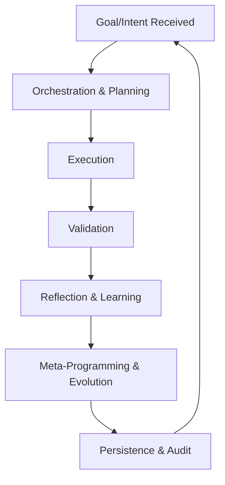

# The Strange Loop: The Contagious, Self-Evolving Architecture

## What is the Strange Loop?

The "strange loop" is the core of the meta-programmable system. It is a recursive, self-referential process where the system continuously analyzes, plans, builds, validates, learns, and evolves itself. Once you understand this loop, you see how it can be applied everywhere—across workflows, skills, plugins, and even the system’s own architecture.

---

## The Universal Loop Pattern

1. **Goal/Intent Received**  
   The system receives a high-level goal, intent, or feedback (from a user, agent, or itself).

2. **Orchestration & Planning**  
   The OrchestratorAgent breaks down the goal, coordinates agents, and decides the next steps. The PlannerAgent decomposes the goal into actionable tasks and plans.

3. **Execution**  
   The MakerAgent implements the plan, using or generating new skills, plugins, or APIs as needed.

4. **Validation**  
   The CheckerAgent validates the results, ensuring quality, security, and compliance.

5. **Reflection & Learning**  
   The ReflectorAgent analyzes outcomes, extracts lessons, and suggests improvements or new capabilities.

6. **Meta-Programming & Evolution**  
   The system can generate new skills, APIs, or workflows, integrating them back into itself. This closes the loop and enables continuous self-improvement.

7. **Persistence & Audit**  
   All knowledge, feedback, and changes are logged and persisted for future learning and traceability.

---

## Why is it Contagious?

Once this loop is established, it can be applied recursively:
- Every new skill, plugin, or workflow can itself be improved by the same loop.
- The system can bootstrap new capabilities from high-level intent or blueprints.
- Any agent, process, or even the architecture itself can be evolved by looping through these steps.

This is why the architecture is "contagious"—it spreads and applies itself to every part of the system, enabling universal, template-driven, agent-orchestrated evolution.

---

## Diagram: The Strange Loop

---

## Applying the Loop: Step by Step

1. **Start with a goal or feedback.**
2. **Let the system break it down, plan, and execute.**
3. **Validate and reflect on the results.**
4. **Evolve the system by generating new skills, APIs, or workflows.**
5. **Repeat the loop for every new capability, feedback, or improvement.**

---

## Deep Dive: How the Loop Powers Everything

- **Blueprint-to-Code:** The system can take a high-level blueprint and, through the loop, generate, validate, and integrate new code or APIs at runtime.
- **Plugin Registration:** New plugins are created, validated, and registered through the same loop, ensuring quality and security.
- **Agent Orchestration:** Each agent (Orchestrator, Planner, Maker, Checker, Reflector) is both a participant and a product of the loop.
- **Context Management:** The loop maintains and evolves context, knowledge, and state across iterations.
- **Continuous Improvement:** Every cycle through the loop makes the system smarter, more capable, and more aligned with user and system goals.

---

## The Takeaway

The strange loop is the engine of self-evolution. Once you see it, you can apply it everywhere—building, improving, and evolving software, workflows, and even the system itself, one loop at a time.

> "Build the software. Loop the software. Evolve the software. Repeat."
