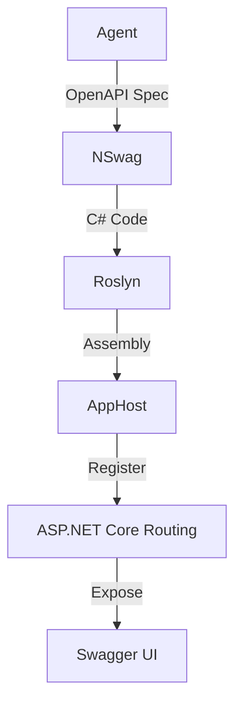

# Dynamic API

This section explains how the system enables dynamic API generation and registration at runtime using OpenAPI/NSwag and Roslyn, supporting rapid extensibility and integration.

## Overview
Dynamic API generation allows the system (or its agents) to expose new REST endpoints on demand, without redeployment. This is achieved by:
- Accepting OpenAPI (Swagger) specifications as input (from agents or users)
- Generating C# controller code using NSwag
- Compiling the code at runtime with Roslyn
- Registering the new controller and endpoints with ASP.NET Core routing
- Documenting the new endpoints in Swagger UI for discoverability

## How It Works

1. **OpenAPI Spec Creation**
   - An agent or user provides an OpenAPI spec describing the desired endpoint(s), including paths, methods, request/response schemas, and documentation.

2. **NSwag Code Generation**
   - The system uses NSwag to generate C# controller code from the OpenAPI spec.
   - The generated code includes models, controllers, and method stubs matching the spec.

3. **Roslyn Runtime Compilation**
   - The generated code is compiled in-memory using the Roslyn compiler.
   - Security checks and validation are performed before loading the assembly.

4. **Controller Registration**
   - The compiled assembly is loaded, and new controllers are registered with the ASP.NET Core application at runtime.
   - Endpoints become immediately available for use, without restarting the application.

5. **Swagger UI Documentation**
   - The new endpoints are automatically included in the Swagger UI, providing interactive documentation and client SDK generation.

## Use Cases
- **Expose new skills as APIs:** Agents can make internal skills available as REST endpoints for integration with other systems.
- **Rapid prototyping:** Developers or agents can quickly add and test new APIs without code changes or redeployment.
- **Self-evolving interfaces:** The system can adapt its API surface in response to changing requirements or user feedback.

## Security & Governance
- All dynamic APIs are subject to authentication and authorization policies.
- Approval workflows and audit logs track the creation and modification of dynamic endpoints.
- Security validation is performed on generated code to prevent unsafe operations.

## Example Workflow

## Best Practices
- Version all dynamic APIs and document changes in the registry.
- Test new endpoints in a staging environment before exposing to production.
- Use fine-grained authorization for sensitive operations.

---

**See also:** [Extensibility](../architecture/extensibility.md), [Plugin System](plugin-system.md)
