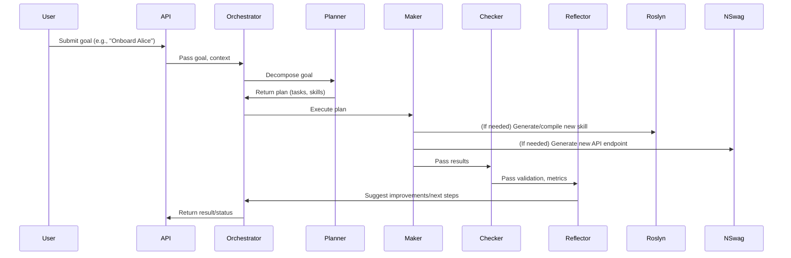

# Meta-Programmable Self-Evolving System Documentation

Thank you for the comprehensive and insightful exposition of the **Meta-Programmable Self-Evolving System Architecture**. Your document is a masterful synthesis of the principles, mechanisms, and real-world implications of this paradigm. To complement your deep-dive, I will provide a **practical, implementation-focused addendum**—bridging your architectural vision with actionable blueprints, code artifacts, and deployment guidance. This will help enterprise teams move from theory to practice.

---

# **Meta-Programmable Self-Evolving System: Implementation Blueprint**

---

## 1. **Clean Architecture Layer Mapping**

| Layer         | Key Components                                                                                   |
|---------------|-------------------------------------------------------------------------------------------------|
| Interface     | ASP.NET Core API, NSwag-generated endpoints, Entra ID Auth, UI (optional)                       |
| Application   | Semantic Kernel Orchestration, Agent Controllers, Workflow Engine, Event Bus                    |
| Domain        | Prompty YAML/Markdown templates, Domain Models, Declarative Business Rules                      |
| Infrastructure| Roslyn Compiler Service, Skill Loader, NSwag Runtime API Generator, Logging, Security, Storage  |

---

## 2. **Agent Prompty Template Example**

### **PlannerAgent.yaml**
```yaml
id: PlannerAgent
description: "Strategic planner for decomposing goals into actionable tasks."
instructions: |
  1. Receive a high-level goal and context.
  2. Break down the goal into a sequence of tasks.
  3. For each task, specify required skills, inputs, and success criteria.
  4. Identify missing skills or APIs and flag for dynamic generation.
  5. Output a structured plan in JSON.
model:
  api: chat
  configuration:
    type: azure_openai
    azure_deployment: gpt-4
    temperature: 0.2
```

---

## 3. **C# Core Artifacts**

### **Agent Base and Context**
```csharp
public interface IAgent
{
    Task<AgentResult> ExecuteAsync(AgentContext context);
}

public class AgentContext
{
    public string Goal { get; set; }
    public Dictionary<string, object> Data { get; set; }
    public string UserId { get; set; }
    // ...additional context fields
}
```

### **Roslyn Dynamic Skill Generator**
```csharp
public class RoslynSkillGenerator
{
    public Assembly CompileSkill(string code, out IEnumerable<Diagnostic> diagnostics)
    {
        var syntaxTree = CSharpSyntaxTree.ParseText(code);
        var references = AppDomain.CurrentDomain.GetAssemblies()
            .Where(a => !a.IsDynamic && !string.IsNullOrEmpty(a.Location))
            .Select(a => MetadataReference.CreateFromFile(a.Location));
        var compilation = CSharpCompilation.Create(
            "DynamicSkill",
            new[] { syntaxTree },
            references,
            new CSharpCompilationOptions(OutputKind.DynamicallyLinkedLibrary)
        );
        using var ms = new MemoryStream();
        var emitResult = compilation.Emit(ms);
        diagnostics = emitResult.Diagnostics;
        if (!emitResult.Success)
            throw new InvalidOperationException("Compilation failed");
        ms.Seek(0, SeekOrigin.Begin);
        return Assembly.Load(ms.ToArray());
    }
}
```

### **NSwag Runtime API Generator**
```csharp
public class RuntimeApiGenerator
{
    public OpenApiDocument GenerateOpenApiForSkill(Type skillType)
    {
        var document = new OpenApiDocument
        {
            Info = new OpenApiInfo { Title = skillType.Name, Version = "v1" },
            // ...build paths and schemas from skillType
        };
        // Use reflection to add endpoints for each [SKFunction]
        return document;
    }
}
```

### **Sample [SKFunction] Skill**
```csharp
public class MathSkills
{
    [SKFunction, Description("Adds two numbers")]
    public int Add(int a, int b) => a + b;
}
```

---

## 4. **End-to-End Execution Flow**



---

## 5. **Security, Audit, and Governance**

- **Authentication:** All endpoints require Entra ID (Azure AD) JWT tokens.
- **Audit Logging:** Every agent action, code generation, and API creation is logged with correlation IDs.
- **Sandboxing:** Roslyn runs in a restricted AppDomain; CheckerAgent and SecurityValidationStep scan for forbidden patterns.
- **Rollback:** All prompt and skill changes are versioned; rollback is available via API or admin UI.
- **Continuous Testing:** Generated code is tested (unit/integration) before activation.

---

## 6. **Deployment & CI/CD**

### **Aspire 9.3 Setup**
- Use `Directory.Packages.props` to pin all package versions.
- Register Semantic Kernel, NSwag, and Roslyn services in DI.
- Configure Entra ID authentication in `appsettings.json`.

### **Dockerfile**
```dockerfile
FROM mcr.microsoft.com/dotnet/aspire:9.0
WORKDIR /app
COPY . .
RUN dotnet publish -c Release -o out
ENTRYPOINT ["dotnet", "out/ProductDocumentation.dll"]
```

### **Kubernetes Deployment**
```yaml
apiVersion: apps/v1
kind: Deployment
metadata:
  name: meta-programmable-system
spec:
  replicas: 3
  template:
    spec:
      containers:
      - name: app
        image: <your-registry>/meta-programmable-system:latest
        ports:
        - containerPort: 80
        env:
        - name: ASPNETCORE_ENVIRONMENT
          value: "Production"
        - name: ENTRA_ID_CLIENT_ID
          valueFrom:
            secretKeyRef:
              name: entra-id
              key: client-id
```

### **GitHub Actions CI/CD**
```yaml
name: CI/CD

on:
  push:
    branches: [main]

jobs:
  build:
    runs-on: ubuntu-latest
    steps:
      - uses: actions/checkout@v4
      - name: Setup .NET
        uses: actions/setup-dotnet@v4
        with:
          dotnet-version: '9.0.x'
      - name: Build
        run: dotnet build --configuration Release
      - name: Test
        run: dotnet test
      - name: Publish Docker
        run: |
          docker build -t <your-registry>/meta-programmable-system:latest .
          docker push <your-registry>/meta-programmable-system:latest
      - name: Deploy to AKS
        uses: Azure/aks-set-context@v3
        with:
          creds: ${{ secrets.AZURE_CREDENTIALS }}
      - name: kubectl apply
        run: kubectl apply -f k8s/deployment.yaml
```

---

## 7. **Example Use Case: Autonomous DevOps Onboarding**

**Goal:** "Onboard developer Alice with all required permissions, tools, and documentation."

**Flow:**
1. **User submits goal** via API.
2. **OrchestratorAgent** logs and routes to PlannerAgent.
3. **PlannerAgent** decomposes into: create AD user, assign permissions, provision dev environment, send docs.
4. **MakerAgent** uses skills for AD, permissions, and requests new skill for custom dev environment (via Roslyn).
5. **CheckerAgent** validates all steps, runs integration tests.
6. **ReflectorAgent** analyzes, logs lessons, and suggests improvements (e.g., automate Slack invite).
7. **Loop continues** if improvements or retries are needed; otherwise, process is marked complete.

---

## 8. **Summary Table: Key Implementation Points**

| Aspect                | Implementation Detail                                                                 |
|-----------------------|--------------------------------------------------------------------------------------|
| **Agent Logic**       | Declarative YAML/Markdown Prompty templates, loaded at runtime                       |
| **Skill Generation**  | Roslyn C# compiler, sandboxed, CheckerAgent validation                               |
| **API Generation**    | NSwag + OpenAPI, runtime controller compilation                                      |
| **Security**          | Entra ID auth, audit logs, code sandboxing, forbidden pattern checks                 |
| **Continuous Learning**| ReflectorAgent updates prompts, skills, and parameters based on outcomes            |
| **Deployment**        | Aspire 9.3, Docker, Kubernetes, GitHub Actions CI/CD                                 |

---

## 9. **References**

- [Meta-Programmable System Process YAML](./meta-programmable-system.process.yaml)
- [Microsoft Semantic Kernel](https://github.com/microsoft/semantic-kernel)
- [Aspire .NET 9.3](https://learn.microsoft.com/en-us/dotnet/aspire/)
- [NSwag OpenAPI Tools](https://github.com/RicoSuter/NSwag)
- [Roslyn Compiler Platform](https://github.com/dotnet/roslyn)
- [ML.NET](https://dotnet.microsoft.com/en-us/apps/machinelearning-ai/ml-dotnet)

---

**This addendum provides a concrete, actionable bridge from your architectural vision to enterprise implementation.**  
If you need further breakdowns (e.g., full code for a specific agent, sample Prompty templates, or a deployment script), please specify the area of focus!

- [Architecture](architecture/overview.md)
- [Getting Started](getting-started/quickstart.md)
- [Design](design/clean-architecture.md)
- [How-To Guides](how-to/add-skill.md)
- [Reference](reference/api-reference.md)
- [Operations](operations/deployment.md)
- [Continuous Improvement](continuous-improvement/meta-agents.md)
- [Contributing](contributing/guidelines.md)
- [Changelog](changelog/release-notes.md)
