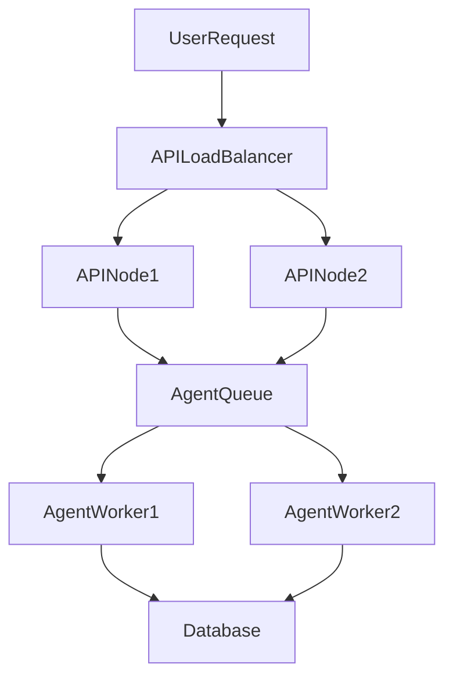

# Scaling

Scaling the Meta-Programmable Self-Evolving System
==================================================

This section provides comprehensive guidance for scaling the system both horizontally and vertically, with a focus on distributed agent orchestration, cloud-native deployment, and enterprise-grade reliability.

## 1. Horizontal Scaling

- **Stateless API Layer:**
  - Deploy multiple instances of the ASP.NET Core Web API behind a load balancer (e.g., Azure Application Gateway, AWS ALB, or NGINX).
  - Ensure all state is externalized (database, distributed cache, or message bus) so any instance can handle any request.

- **Distributed Agent Orchestration:**
  - Use distributed queues (e.g., Azure Service Bus, RabbitMQ, NATS) to coordinate agent tasks across nodes.
  - Each agent instance can pick up tasks from the queue, enabling parallel processing and resilience.
  - For long-running or stateful agent threads, persist context in the database or a distributed cache (e.g., Redis).

- **Dynamic Plugin Loading:**
  - Store dynamically generated plugins/skills in a shared persistent store (e.g., blob storage, database).
  - On startup or plugin update, all nodes reload the latest plugins to ensure consistency.

## 2. Vertical Scaling

- **Resource Allocation:**
  - Increase CPU, memory, and I/O resources for nodes handling heavy LLM inference or plugin compilation.
  - Use .NET Aspire and container orchestrators (Kubernetes, Azure Container Apps) to set resource limits and requests.

- **LLM/AI Service Scaling:**
  - For OpenAI/Azure OpenAI, use multiple model deployments or scale the backend service as needed.
  - For on-prem LLMs, deploy inference servers with autoscaling groups.

## 3. Cloud-Native & Kubernetes

- **Kubernetes Deployment:**
  - Use Helm charts or Bicep/Terraform for infrastructure as code.
  - Define deployments, services, ingress, and config maps for all system components.
  - Use Horizontal Pod Autoscaler (HPA) to scale pods based on CPU/memory or custom metrics (e.g., queue length).

- **Service Mesh & Observability:**
  - Integrate with service mesh (Istio, Linkerd) for secure, observable, and reliable inter-service communication.
  - Use OpenTelemetry and Aspire for distributed tracing and metrics.

## 4. Distributed Memory & State

- **Database Scaling:**
  - Use managed Postgres/SQL with read replicas and failover.
  - Partition large tables (e.g., logs, knowledge base) if needed.

- **Distributed Cache:**
  - Use Redis or similar for fast, shared context and agent state.
  - Ensure cache invalidation and consistency across nodes.

## 5. Agent Federation & Multi-Region

- **Federated Agents:**
  - Deploy agents in multiple regions or data centers for geo-redundancy.
  - Use message bus or event streaming (Kafka, NATS JetStream) for cross-region coordination.

- **Global Load Balancing:**
  - Use DNS-based or cloud-native global load balancers to route requests to the nearest healthy region.

## 6. Best Practices

- **Statelessness:**
  - Design all API and agent logic to be stateless; use context objects and persistent stores for state.

- **Idempotency:**
  - Ensure all agent actions and API endpoints are idempotent to support retries and distributed execution.

- **Health Checks:**
  - Implement readiness and liveness probes for all services.

- **Rolling Upgrades:**
  - Use rolling deployments and blue/green strategies to minimize downtime.

- **Monitoring & Alerting:**
  - Set up dashboards and alerts for scaling metrics (CPU, memory, queue length, error rates).

## 7. Example: Scaling Agent Orchestration

This diagram shows how user requests are distributed across API nodes, which enqueue agent tasks for distributed workers, all sharing a common database.

---

**See also:** [Deployment](deployment.md), [Monitoring](../how-to/monitoring.md), [Database Schema](../reference/database-schema.md)
